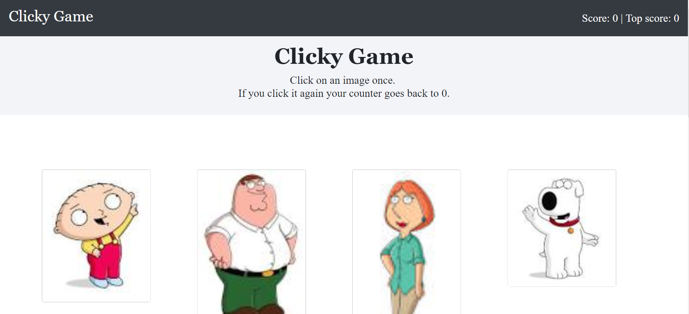

# Clicky Game

## Overview

A memory game with React. This application breaks the UI into components, manages component state, and responds to user events.

The application should renders different images to the screen. Each image listens for click events and keeps track of the user's score. The user's score increases when clicking an image for the first time. It resets if the image is clicked a second time.